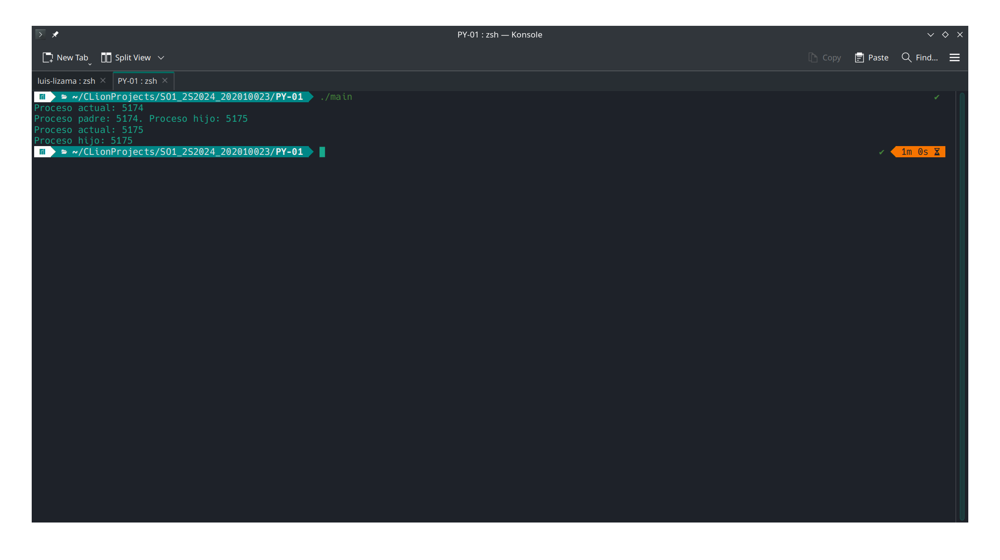
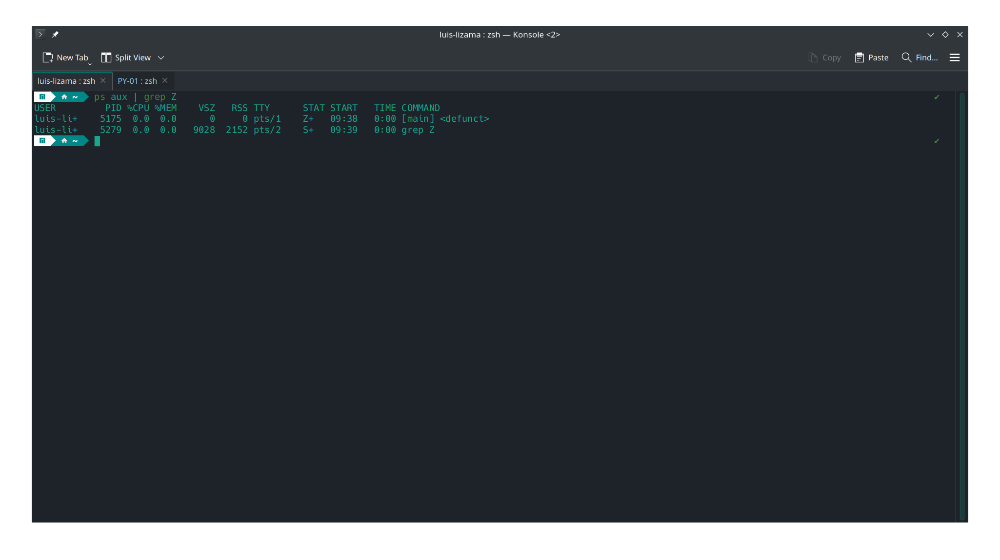

# **MD - Informe de Procesos e Hilos**

## **Inciso 1:**

Existen **8 procesos**, incluyendo el proceso principal. Antes de ejecutar el programa, existe un único proceso. Cuando
este llega al primer `fork()`, se duplica, por lo que ahora tenemos dos procesos. Siguiendo este patrón, al llegar al
tercer `fork()`, tendremos un total de **8 procesos**.

## **Inciso 2:**

Se ha generado un **proceso zombie** utilizando el siguiente código:

```c
#include <stdio.h>
#include <stdlib.h>
#include <sys/types.h>
#include <sys/wait.h>
#include <unistd.h>

int main() {
    pid_t pid = fork();

    printf("Proceso actual: %d\n", getpid());

    if (pid > 0) {
        printf("Proceso padre: %d. Proceso hijo: %d\n", getpid(), pid);

        sleep(60);
        wait(NULL);
    } else if (pid == 0) {
        printf("Proceso hijo: %d\n", getpid());

        exit(0);
    } else {
        printf("Error al crear el proceso.\n");
    }

    return 0;
}
```

La existencia del proceso zombie ha sido confirmada mediante el uso del comando `ps aux | grep Z`, donde se observó el
estado **"Z+"**. A continuación, se presentan las capturas de pantalla que muestran los resultados:

- **Imagen 1: Ejecución del programa y PID del proceso hijo**
  

- **Imagen 2: Confirmación del proceso zombie**
  

## **Inciso 3:**

El código presentado en este inciso genera un total de **6 procesos** y **8 hilos**. Los hilos se generan mediante la
función `pthread_create()`, y los procesos se gestionan a través de llamadas a `fork()`. El siguiente código ilustra
cómo se manejan los procesos e hilos:

```c
#include <pthread.h>
#include <stdio.h>
#include <stdlib.h>
#include <sys/types.h>
#include <sys/wait.h>
#include <unistd.h>

void *thread_function(void *arg) {
    printf("Hilo creado, ejecutando en el proceso con PID: %d\n", getpid());

    return NULL;
}

int main() {
    pid_t pid;
    pid = fork();

    if (pid == 0) {
        fork();

        pthread_t thread;

        if (pthread_create(&thread, NULL, thread_function, NULL) != 0) {
            perror("Error al crear el hilo.");

            exit(1);
        }

        pthread_join(thread, NULL);
    }

    fork();

    if (pid > 0) {
        while (wait(NULL) > 0);
    }

    return 0;
}
```
